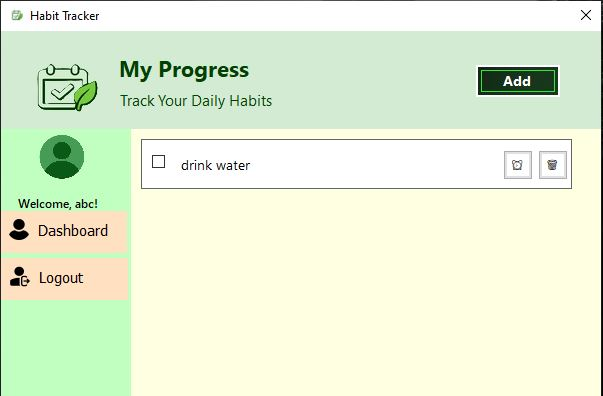
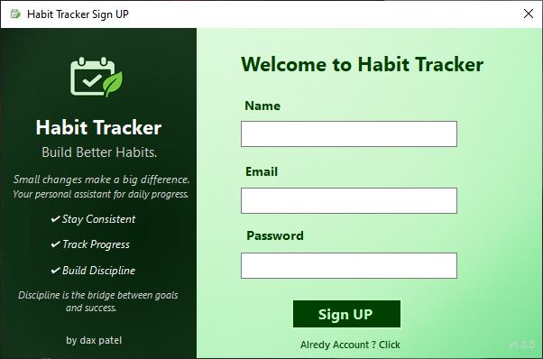

# 🌿 Habit Tracker – VB.NET Desktop Application

A simple and elegant **Habit Tracking Application** built using **VB.NET (Windows Forms)** and **MS Access Database**.  
This project helps users build good habits, stay consistent, and get daily reminders.

---

## 📸 Screenshots

*(Add some screenshots of your forms here — login, dashboard, popups, etc.)*  
Example:



---

## 🚀 Features

- 🧩 **Login & Signup System** (with Access DB)
- 🕒 **Daily Habit Tracking**
- 🔔 **Custom Reminder Notifications**
- 💬 **Modern Custom Popups** (instead of MessageBox)
- 🎨 **Animated UI and Styled Forms**
- ⚙️ **Dynamic & Flexible Layouts** (responsive forms)
- 💾 **Local Database Integration (MS Access)**

---

## 🧰 Technologies Used

| Component | Description |
|------------|-------------|
| **Language** | VB.NET |
| **Framework** | .NET Framework (WinForms) |
| **Database** | Microsoft Access (.accdb) |
| **IDE** | Visual Studio |
| **Other Tools** | ADO.NET, OleDb Connection |

---

## 🧩 Project Structure

```HabitTracker/
├── HabitTracker.sln
├── HabitTracker/
│   ├── Form1.vb              # Login & Signup
│   ├── Form2.vb              # Dashboard
│   ├── Form3.vb              # Habit management
│   ├── loginconfirm.vb       # Logout confirmation popup
│   ├── CustomPopup.vb        # Replaces MessageBox
│   ├── bin/
│   │   └── Debug/
│   │       └── sign up.accdb # Database file
│   └── ... 
```
---

## ⚡ How to Run

1. **Clone or Download** the repository:
   ```bash
   git clone https://github.com/yourusername/HabitTracker.git

2. Open in Visual Studio

3. Ensure you have:
    .NET Framework installed
    Microsoft.ACE.OLEDB.12.0 provider (for Access DB)
    
4. Press Start ▶️ to run the application.

💾 Database Info

File: sign up.accdb
Location: bin\Debug
All tables pre-created (you can clear data if needed)

Connection string uses:
Dim dbPath As String = Path.Combine(Application.StartupPath, "sign up.accdb")

👤 Author 

Dax Rakholiya
💬 Connect with me on [LinkedIn](https://www.linkedin.com/in/dax-rakholiya-908ab2289/)  
💻 View more projects on [GitHub](https://github.com/daxpatel7)

⭐ Support

If you like this project, consider starring 🌟 it on GitHub — it helps a lot!
And feel free to share suggestions or improvements 🙌
